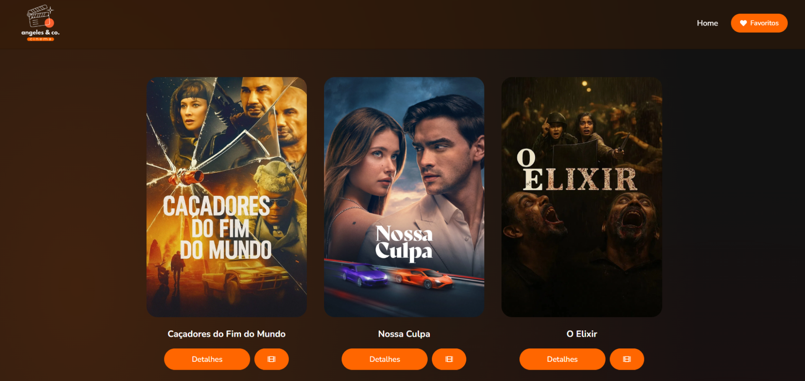

<h1 align="center"> Angeles&co Cinema - Projeto Front-End </h1>

 Um projeto desenvolvido com HTML, CSS, JavaScript e React, inspirado em um tutorial do curso de FullStack do Sujeito Programador, mas com um layout totalmente reformulado e com uma interface moderna e responsiva. 

 O objetivo foi criar uma aplicação prática para explorar fundamentos de React e aprimorar minhas habilidades de front-end com integração de APIs externas. 

    

## Aprendizados
Durante o desenvolvimento do projeto pratiquei e aprimorei:
- Estruturação em React
- Criação de uma UI moderna, limpa e intuitiva
- Design responsivo, adaptando o layout em diferentes tamanhos
- Consumo da API do The Movie Database
- Organização do código e boas práticas de desenvolvimento front-end

## Tecnologias Utilizadas
- React
- JavaScript
- HTML5
- CSS3
- API The Movie Database
- Netlify

## Funcionalidades
- Lista de filmes com dados reais da API
- Página de detalhes de cada filme
- Layout responsivo
- Navegação dinâmica entre páginas
- Interface com design moderno e intuitivo

## Projeto
- [Acesse o projeto finalizado](https://angelescocinema.netlify.app/)

---

Feito por Fernanda Bortoletto